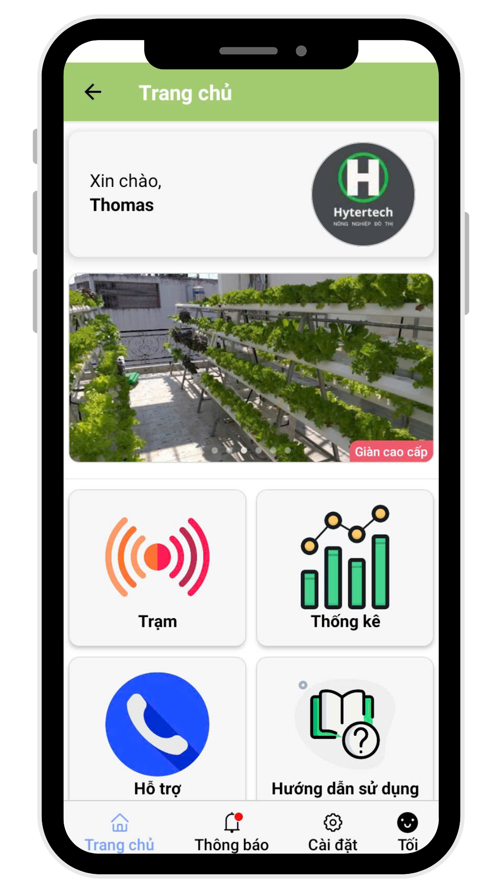
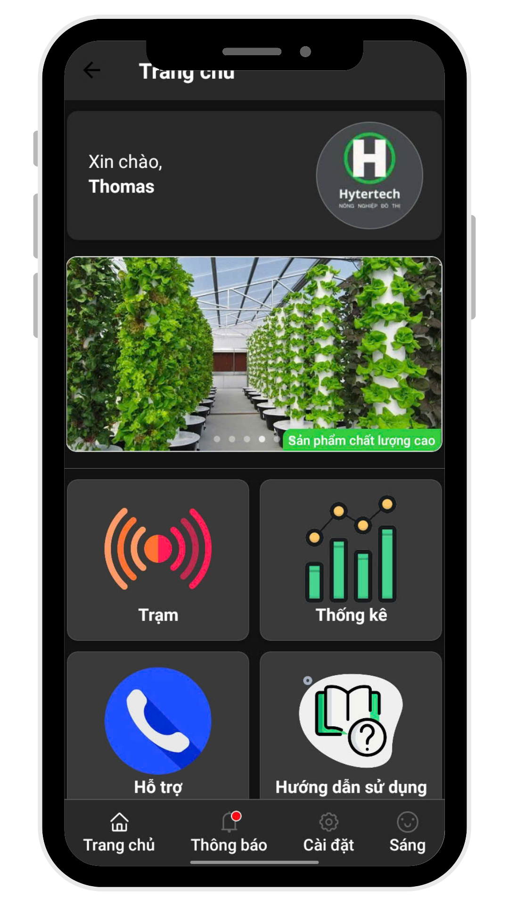
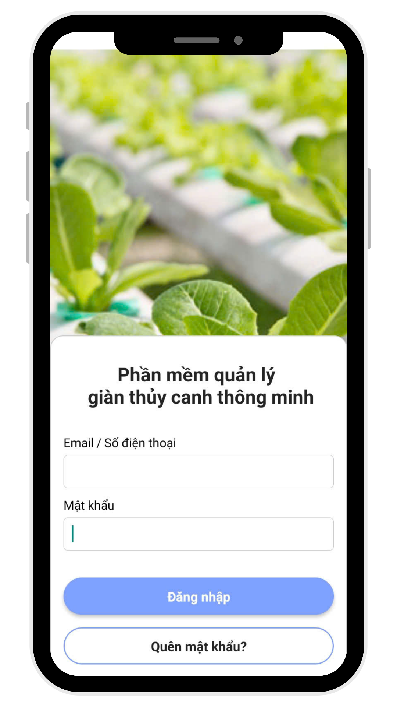
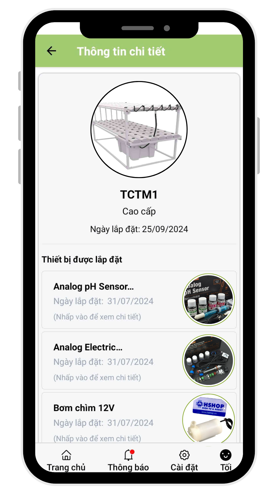
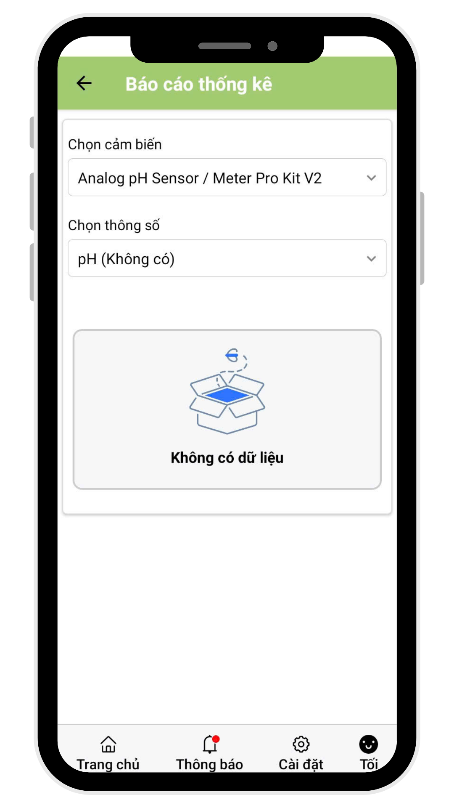
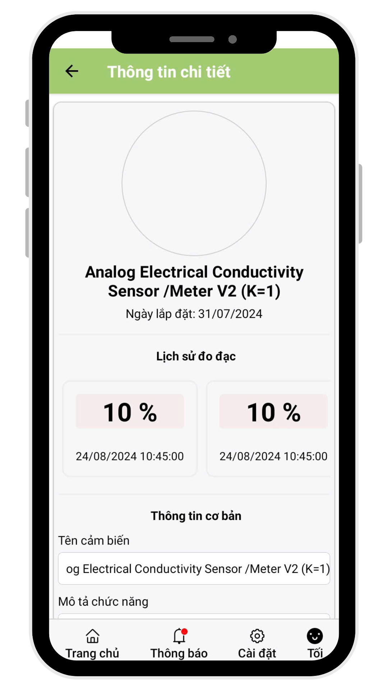
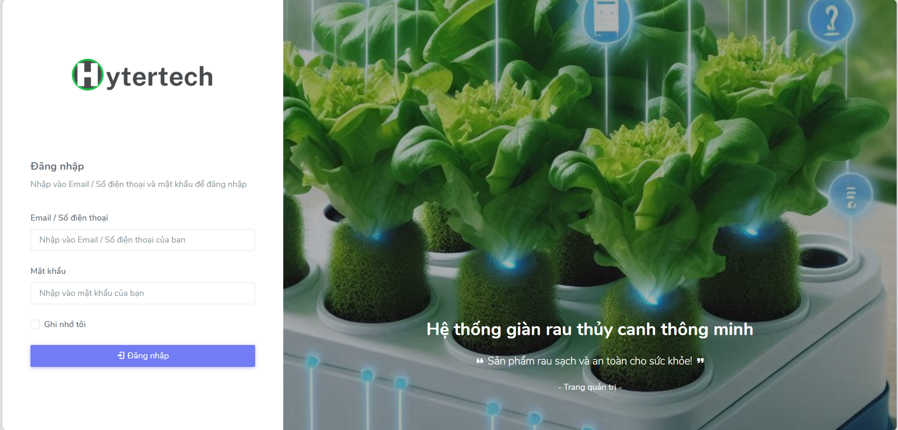
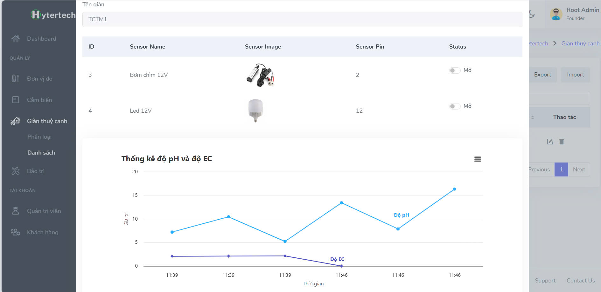

## Ứng dụng Mobile App kết hợp quản lý giàn thuỷ canh thông minh Hytertech
<h4><i>Khởi nghiệp Innobe 2024</i></h4>

- <b>Người thực hiện: </b> Đặng Nguyễn Tiền Hậu
- <b>Thời gian: </b>04/2024 - 11/2024

-----------------------
- Dự án hướng tới việc tạo một ứng dụng trên di động để hỗ trợ người dùng giám sát, điều khiển từ xa các thiết bị trên giàn thuỷ canh.
- Ứng dụng là nơi thu thập số liệu mà giàn thuỷ canh lấy được từ môi trường (thông qua các thiết bị đo đạc, cảm biến) để báo cáo trên giao diện.

<h4>Một số hình ảnh của dự án</h4>
<h5>Giao diện ứng dụng Mobile (React Native)</h5>

  
  

  
  

  
  

<h5>Giao diện Website (Laravel)</h5>

  
  

-----------------------
### Các tính năng chính
1. Đăng nhập và xác thực với CSRF Token.
2. Quản lý một số đối tượng:
    - Quản lý (CRUD) tài khoản.
    - Quản lý (CRUD) thông tin đơn vị đo.
    - Quản lý (CRUD) thông tin cảm biến.
    - Quản lý (CRUD) thông tin giàn thuỷ canh: danh sách giàn đã lắp, phân loại giàn.
    - Quản lý (CRUD) thông tin bảo trì.
    - Báo cáo thông số điều kiện môi trường: độ pH, độ EC.
    - Bật tắt thiết bị trên giàn: đèn chiếu sáng, máy bơm.

-----------------------------------------------
### Kết quả
<b>Ưu diểm: </b>
- Website hoạt động tốt, các chức năng cơ bản và nâng cao đều ổn định.
- Ứng dụng mobile đáp ứng được các yêu cầu cơ bản, phần báo cáo thống kê real-time ổn định.

<b>Hạn chế: </b>
- Website chỉ gói gọn trong quy mô là đề tài khởi nghiệp dự thi, chưa triển khai dự án (thương mại hoá) trong thực tế.
- Các chức năng vẫn còn lỗi nhỏ.

-----------------------------------------------
### Liên Hệ
Nếu bạn có bất kỳ câu hỏi nào hoặc muốn đóng góp cho dự án, hãy liên hệ với tôi qua:

- Email: [tienhau.it@gmail.com](mailto:tienhau.it@gmail.com)
- GitHub: [Thomas Dang](https://github.com/HauDNT)
- LinkedIn: [Hau Dang](https://www.linkedin.com/in/haudnt/)